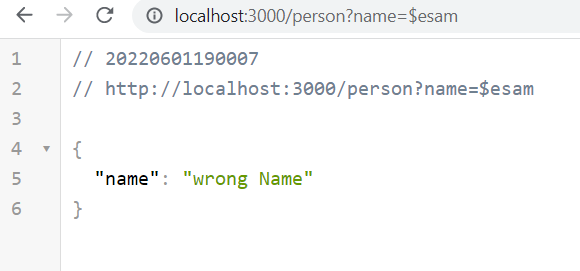

# basic-express-server

## Core, standards compliant Express server

*** We are building a basic Express server using best practices, including server modularization, use of middleware, and tests.***

